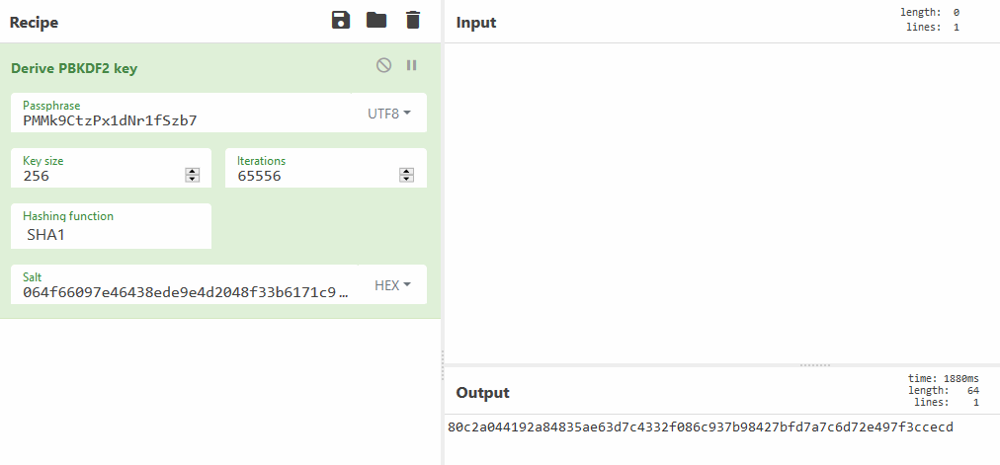

# Manage2Decrypt ManageEngine OpManager Decryptions

ManageEngine has a huge host of products. Many of them store credentials for one reason or another. This repo is here to help decrypt the stored credentials from those products.

**Update**: If you run into newer versions of MangeEngine check out this blog post: https://www.shielder.com/blog/2022/09/how-to-decrypt-manage-engine-pmp-passwords-for-fun-and-domain-admin-a-red-teaming-tale/ by [@ipSlav](https://twitter.com/ipSlav/status/1566805716563906560), [@smaury92](https://twitter.com/smaury92), and [@Th3Zer0](https://twitter.com/Th3Zer0)

## DecryptField.py

Dependencies:
```
pip3 install pgpy pycrypto
```

The ManageEngine database stores many fields in an encrypted format. If the database is PostgreSQL it uses `pgp_sym_decrypt` which is a PostgreSQL function to call PGP/GPG symmectric encryotion functions. It uses the key of `Mickey` to perform the password based encrytion. For example here is a decryption of a password stored in the `VICredential` table.

```
OpManagerDB=> select pgp_sym_decrypt(password::bytea, ‘Mickey’) from vicredential;
     pgp_sym_decrypt
--------------------------
  zrlywGPXhOk2sa1i0lfyzQ==
(1 row)
```

With only two examples so far, the passwords have either come out as clear text, or as Base64. In this case the Base64 is the result of a DES encrytion that ises the key of `APMEXTPR`. This key actually comes from decryting the the database field of `opm, apmConnector` in the `ExternalKeys` table which is `APMEXTPRODjZ_7004PROD_AppManager`. DES only uses the first 8 bytes `APMEXTPR`.

DecryptField taks a command line argument of the `c30c04090102`string from the database for example:
```
# ./decryptfield.py c30c04090102f5fc1779acd46f4fd251015209f569296a29016eb9984aee9a6704a4a402aa3b33de2428f76219e2a4551f3bc59d5ba29a21c24d80f0539804b65ea6056946bd428d55bbf7f92a8d9d1f1d33ebcd4932e351ac2faa45b4d5fbf749
PGP Decrypted Message: APMEXTPRODjZ_7004PROD_AppManager
```


## DecryptDB.py

The ManageEngine database passwords can be found in the `database_params.conf` file usually located here: `/opt/ManageEngine/OpManager/conf/database_params.conf`. There should be two users `dbuser` and `rouser`. This script should be able to decrypt both user's password. You need one other piece of information in order to complete the decryption, and that is the `CryptTag` field from the `customer-config.xml` file. This file is usually located here: `/opt/ManageEngine/OpManager/conf/customer-config.xml`.

You need to edit the `passphrase` (CryptTag) and `encrypted` variables in the script to complete the decryption.

Here is an example run of the script:
```
# python3 decryptdb.py
       Salt: 064f66097e46438ede9e4d2048f33b6171c97338
Cipher Text: 1f9631ae4bb57caeaba1310fab74a36e897307000111dad91e3aed4a29e508fc89dfb54d0001e38a3c9ff498d47edd02
Derived Key: 80c2a044192a84835ae63d7c4332f086c937b98427bfd7a7c6d72e497f3ccecd
Testing Decryption...
Plain Text: ITOM_1de8f7721f913f770bfba5c89c6aed4b

```

## Decryption with CyberChef

I have figured out how to do most of the crypto using just CyberChef:

### DES Decryption


### Database Password Decryption




